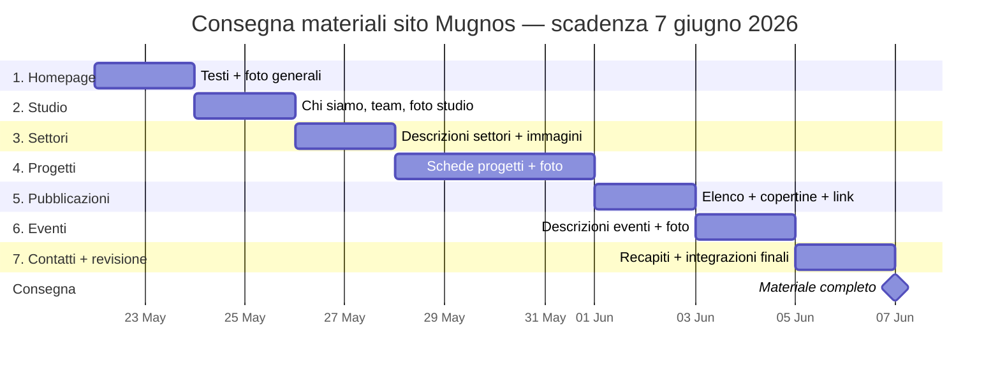

 # Cronoprogramma materiali — Giulia Mugnos

**Periodo:** 22 maggio → **7 giugno 2026** (consegna finale)
**Ordine:** rispetta la sequenza delle pagine del sito. Ogni blocco va consegnato entro la data indicata.

---

## Diagramma Gantt

---

## Tabella di consegna

| # | Pagina | Cosa serve | Da consegnare entro |
|---|--------|------------|---------------------|
| 1 | **Homepage** | Claim/payoff, testo introduttivo studio (3-5 righe), foto/video di apertura, eventuali numeri chiave (anni di attività, progetti realizzati) | **sabato 23 maggio** |
| 2 | **Studio** | "Chi siamo" esteso, mission/vision, storia studio, scheda team (nome, ruolo, bio breve, foto), foto degli ambienti dello studio | **lunedì 25 maggio** |
| 3 | **Settori** | Elenco settori operativi (strutturale, infrastrutturale, geotecnica, ecc.), descrizione breve per ciascun settore (3-5 righe), 1 immagine rappresentativa per settore | **mercoledì 27 maggio** |
| 4 | **Progetti** | Per ogni progetto: titolo, anno, luogo, committente, descrizione (5-10 righe), categoria/settore, **3-6 foto in alta risoluzione**. Priorità ai progetti che vuoi mettere in evidenza | **domenica 31 maggio** |
| 5 | **Pubblicazioni** | Elenco pubblicazioni con: titolo, autore/i, anno, rivista/editore, link o PDF, copertina/immagine se disponibile | **martedì 2 giugno** |
| 6 | **Eventi** | Eventi passati e futuri: titolo, data, luogo, descrizione, foto (per i passati) o locandina (per i futuri) | **giovedì 4 giugno** |
| 7 | **Contatti + revisione** | Indirizzo studio, telefono, email, PEC, P.IVA, orari, mappa, social. **+** materiale mancante / correzioni delle pagine precedenti | **sabato 6 giugno** |
| ★ | **Consegna finale** | Tutto il materiale completo e revisionato | **domenica 7 giugno** |

---

## Note pratiche

- **Foto:** alta risoluzione (lato lungo min. 2000 px), formato JPG o PNG.
- **Testi:** in un unico documento Word/Google Docs per pagina, con titoli chiari.
- **Logo cliente / loghi committenti:** preferibilmente in SVG o PNG con sfondo trasparente.
- **Canale di consegna:** cartella condivisa (Drive/WeTransfer) suddivisa per pagina, una sottocartella per ciascuna riga della tabella.
- **Slittamenti:** ogni ritardo su un blocco si ripercuote sui successivi → la scadenza del **7 giugno** è fissa.
